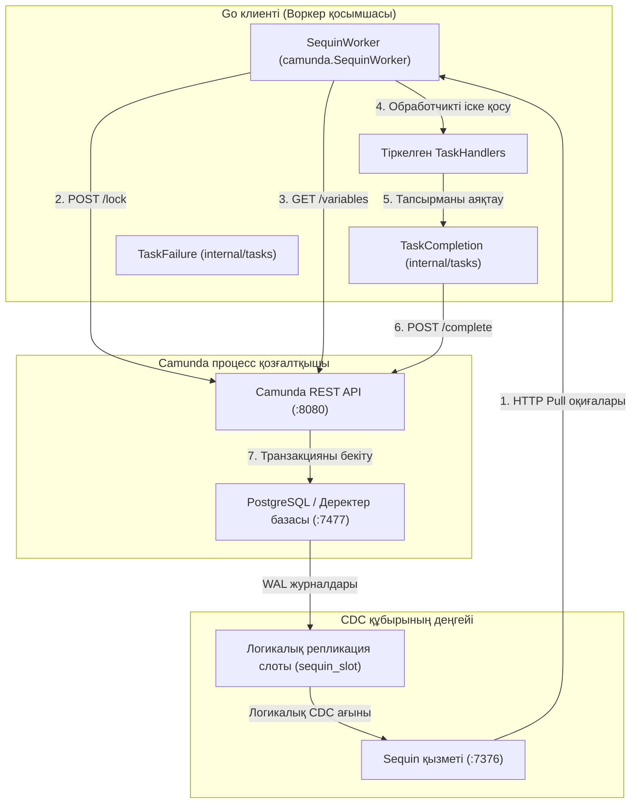

# Camunda сыртқы тапсырмалар клиенті

Camunda 7 сыртқы тапсырмаларына арналған жоғары өнімді Go клиенті, ол дәстүрлі REST сұрауын да, Sequin қолданатын **өзгерістерді бақылау (WAL CDC)** негізіндегі өте жоғары өткізу қабілеттілігін де қолдайды.

---

## 1. Сәулеттік үлгілер

Бұл клиент жүйенің жүктеме талаптарына және орналастыру күрделілігіне байланысты екі түрлі орындау үлгісін қолдайды:

### А. Стандартты REST сұрау сәулеті (классикалық)
Стандартты үлгіде клиент Camunda қозғалтқышына кезеңді түрде `/fetchAndLock` REST сұрауларын жібереді.
- **Артықшылықтары**: Қарапайым, деректер базасын біріктіруді немесе CDC баптауларын қажет етпейді. Кез келген Camunda 7 деректер базасымен жұмыс істейді.
- **Кемшіліктері**: Әрекетсіз күйде деректер базасы мен желіні сұраудың жоғары шығындары. Параллель мульти-инстанстардағы тапсырмалардың бір уақытта көптеп аяқталуы Camunda API ішінде `OptimisticLockingExceptions` қатесін тудыруы мүмкін, бұл ең жоғары жүктеме кезінде 60 секундтық құлыптау таймауттарына әкеледі.

### Б. Жоғары өнімді WAL CDC сәулеті (Sequin негізінде) — Деректер базасынсыз
REST API сұрауын жасаудың орнына, CDC сәулеті тапсырмаларды жасау оқиғаларын **PostgreSQL журналдарынан (WAL)** тікелей **Sequin** ағындық консьюмері арқылы қабылдайды және тапсырмаларды оңтайландырылған REST негізіндегі құлыптаумен өңдейді. Воркердің Camunda деректер базасына **ешқандай тікелей байланысы жоқ**.



#### CDC жұмыс үрдісінің егжей-тегжейі:
1. **Оқиғаны қабылдау**: Жаңа сыртқы тапсырма жасалған кезде, Camunda-ның `act_ru_ext_task` кестесіне жол қосылады. PostgreSQL бұл транзакцияны алдын ала жазу журналына (WAL) жазады.
2. **Sequin арқылы ағынмен беру**: Sequin бұл транзакцияны логикалық репликация слоты (`sequin_slot`) және жарияланым (`sequin_pub`) арқылы қабылдап, оны HTTP Pull кезегі ретінде ұсынады.
3. **HTTP Pull арқылы жеткізу**: `SequinWorker` хабарламаларды Sequin-нен `/receive` арқылы алады. Sequin-нің **көріну таймауты** (Visibility Timeout) бұл хабарламаның тек бір воркерге жеткізілуіне кепілдік береді, бұл деректер базасы деңгейіндегі бәсекелестік құлыптардың қажеттілігін жояды.
4. **REST құлыптауын белсендіру**: Воркер тапсырманы Camunda REST API (`POST /external-task/{id}/lock`) арқылы блоктайды, бұл қозғалтқыштың тапсырманы аяқтауды тексеру талаптарын орындау үшін қажет.
5. **Айнымалыларды сұрау**: Блокталғаннан кейін воркер процесс айнымалыларын Camunda REST API (`GET /process-instance/{id}/variables`) арқылы сұрайды.
6. **Орындау**: Тіркелген өңдегіш (handler) орындалады.
7. **Тапсырманы аяқтау**: Өңдегіш жұмысын аяқтап, тапсырманың орындалуын Camunda қозғалтқышына бекіту үшін REST API (`/external-task/{id}/complete`) пайдаланады.
8. **Растау**: Воркер өңделген оқиғаны кезектен жою үшін Sequin-ге HTTP ACK сұрауын жібереді. Егер уақытша қате орын алса (мысалы, `OptimisticLockingException`), воркер Sequin-ге NACK жібереді, бұл дереу қайта әрекеттенуді тудырады.

---

## 2. Деректер базасын баптау және көшіру (миграция)

### Atlas Go көмегімен деректер базасын орнату
Docker әдепкі конфигурацияларын өзгертпей, CDC репликация слоттары мен жарияланым схемаларын қауіпсіз қосу үшін біз [Atlas Go](https://atlasgo.io/) құралын пайдаланамыз. Конфигурация нұсқасы [atlas.hcl](docker/camunda/atlas.hcl) файлында басқарылады.

Миграциялар репликацияны конфигурацияламас бұрын Camunda схема кестелерінің инициализациялануын күтетін `arigaio/atlas:latest-alpine` іске қосу контейнері арқылы автоматты түрде қолданылады:
- **`20260531100000_init_sequin.sql`**: Sequin пайдаланушысын, репликация слотын және жарияланымды жасайды.
- **`20260531100001_enable_replica_identity.sql`**: CDC жүктемелерінде жолдардың толық жаңартылу деректері болуын қамтамасыз ету үшін `act_ru_ext_task` кестесіне `REPLICA IDENTITY FULL` конфигурациялайды.

### Жоғары өнімділік конфигурациясы
1. **Мақсатты сүзу**: Айнымалылар немесе тарих кестелерінің өзгеруінен туындайтын өнімділік кедергілерін болдырмау үшін Sequin көздерін тек `"public.act_ru_ext_task"` кестесімен шектеңіз.
2. **HTTP Keep-Alives**: Тұрақты порттардың таусылуын (`TIME_WAIT`) болдырмау үшін REST және CDC воркерлері де арнайы бапталған `http.Transport` пулын бірге пайдаланады (`MaxIdleConns = 100`, `MaxIdleConnsPerHost = 100`, `IdleConnTimeout = 90s`).

---

## 3. Қолдану мысалдары

### А. Стандартты REST сұрау воркерін іске қосу
```go
package main

import (
	"context"
	"log/slog"
	"time"
	"github.com/nativebpm/connectors/camunda"
)

func main() {
	logger := slog.Default()
	client, err := camunda.NewClient("http://localhost:8080", "classic-worker")
	if err != nil {
		logger.Error("Failed to init client", "error", err)
		return
	}

	worker := camunda.NewWorker(client, logger)
	worker.SetMaxTasks(20)
	worker.SetPollInterval(100 * time.Millisecond)

	worker.RegisterHandler("creditScoreChecker", func(ctx context.Context, client *camunda.Client, task camunda.ExternalTask, complete camunda.CompleteFunc, fail camunda.FailFunc) error {
		// Бизнес-логика осында
		return complete().Variable("score", 750).Execute()
	}, 60000, []string{"score"})

	worker.Start(context.Background())
}
```

### Б. WAL CDC воркерін (Sequin) іске қосу — Деректер базасынсыз
```go
package main

import (
	"context"
	"log/slog"
	"github.com/nativebpm/connectors/camunda"
)

func main() {
	logger := slog.Default()
	
	// Аяқтау, құлыптау және айнымалыларды алу үшін API клиентін инициализациялау
	client, err := camunda.NewClient("http://localhost:8080", "sequin-worker")
	if err != nil {
		logger.Error("Failed to init client", "error", err)
		return
	}

	// Sequin воркерін Sequin нүктесімен және консьюмерімен инициализациялау
	sequinURL := "http://localhost:7376"
	consumer := "camunda_tasks"

	sequinWorker, err := camunda.NewSequinWorker(client, sequinURL, consumer, logger)
	if err != nil {
		logger.Error("Failed to create Sequin worker", "error", err)
		return
	}

	sequinWorker.RegisterHandler("creditScoreChecker", func(ctx context.Context, client *camunda.Client, task camunda.ExternalTask, complete camunda.CompleteFunc, fail camunda.FailFunc) error {
		// Бизнес-логика осында
		return complete().Variable("score", 750).Execute()
	})

	sequinWorker.Start(context.Background())
}
```

---

## 4. Өнімділік көрсеткіштері

`loan-granting.bpmn` жұмыс үрдісін орналастыру арқылы эталондық тестілеу барысында біз дәстүрлі REST сұрауын және WAL CDC-ті (Sequin Pull консьюмерін пайдалана отырып) жоғары жүктеме жағдайында бағаладық:
- **REST сұрау**: Масштабтау кезіндегі агрессивті сұрау құлыптарды күту күйлеріне және транзакциялық шегінулерге әкеледі, бұл параллель тапсырмалар бір уақытта аяқталған кезде 60 секундтық құлыптау таймауттарын тудырады.
- **Sequin WAL CDC (Деректер базасынсыз)**:
  - **500 инстанс** (2 047 тапсырма): **20.51 с** ішінде **24.37 RPS / 99.79 TPS** көрсеткішімен аяқталды.
  - **1000 инстанс** (4 014 тапсырма): **71.52 с** ішінде **13.98 RPS / 56.13 TPS** көрсеткішімен аяқталды (кідіріс көрсеткіштері: p50=57с, p90=67.5с, p99=70.4с).
  - **2000 инстанс** (8 036 тапсырма): **22.41 с** ішінде **89.26 RPS / 358.66 TPS** көрсеткішімен аяқталды (кідіріс көрсеткіштері: p50=13.8с, p90=20.4с, p99=21.1с).
  - **3000 инстанс** (12 027 тапсырма): **133.62 с** ішінде **22.45 RPS / 90.01 TPS** көрсеткішімен аяқталды (бұл PostgreSQL процессорының толуы және TCP қосылымдар пулының шегіне жететін ең жоғары жүктеме шегі).

Өнімділікті тестілеу туралы толық есептерді [толық есептен](examples/loadtest/camunda-load-test-results.md) қараңыз.
