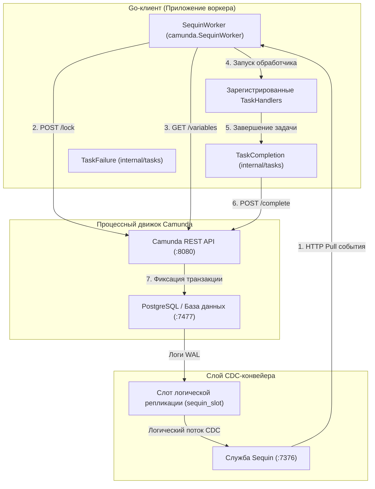

# Клиент внешних задач Camunda

Высокопроизводительный Go-клиент для внешних задач Camunda 7, поддерживающий как традиционный REST-опрос, так и обработку со сверхвысокой пропускной способностью на основе **захвата изменений данных (WAL CDC)** с использованием Sequin.

---

## 1. Архитектурные паттерны

Этот клиент поддерживает два различных паттерна выполнения в зависимости от требований к нагрузке вашей системы и сложности развертывания:

### А. Стандартная архитектура REST-опроса (классическая)
В стандартном паттерне клиент периодически отправляет REST-запросы `/fetchAndLock` в движок Camunda.
- **Плюсы**: Простота, отсутствие необходимости интеграции базы данных или настройки CDC. Работает с любой базой данных Camunda 7.
- **Минусы**: Высокие накладные расходы на базу данных и сетевой опрос в состоянии покоя. Высокая частота одновременных завершений задач в параллельных мульти-инстансах может вызывать исключения `OptimisticLockingExceptions` внутри API Camunda, приводя к 60-секундным таймаутам блокировок при пиковых нагрузках.

### Б. Высокопроизводительная архитектура WAL CDC (на базе Sequin) — без прямого подключения к БД
Вместо опроса REST API архитектура CDC перехватывает события создания задач напрямую из **журнала упреждающей записи PostgreSQL (WAL)** с помощью потребителя потока **Sequin** и обрабатывает задачи с оптимизированной блокировкой через REST. Воркер имеет **нулевое прямое подключение** к базе данных Camunda.



#### Подробный рабочий процесс CDC:
1. **Захват событий**: При создании новой внешней задачи строка вставляется в таблицу `act_ru_ext_task` Camunda. PostgreSQL записывает эту транзакцию в журнал упреждающей записи (WAL).
2. **Потоковая передача через Sequin**: Sequin захватывает эту транзакцию через слот логической репликации (`sequin_slot`) и публикацию (`sequin_pub`) и предоставляет ее в виде очереди HTTP Pull.
3. **Доставка через HTTP Pull**: `SequinWorker` получает сообщения из Sequin через `/receive`. **Таймаут видимости** (Visibility Timeout) Sequin гарантирует, что это сообщение будет доставлено только одному воркеру, устраняя необходимость в блокировках конкуренции на уровне базы данных.
4. **Активация блокировки через REST**: Воркер блокирует задачу через REST API Camunda (`POST /external-task/{id}/lock`), чтобы удовлетворить требованиям валидации завершения задач движком.
5. **Запрос переменных**: После блокировки воркер запрашивает переменные процесса через REST API Camunda (`GET /process-instance/{id}/variables`).
6. **Выполнение**: Выполняется зарегистрированный обработчик.
7. **Завершение задачи**: Обработчик завершает выполнение и использует REST API (`/external-task/{id}/complete`) для фиксации завершения задачи в движке Camunda.
8. **Подтверждение**: Воркер отправляет HTTP ACK-запрос в Sequin для удаления обработанного события из очереди. При возникновении временной ошибки (например, `OptimisticLockingException`) воркер отправляет NACK в Sequin, вызывая мгновенную повторную попытку.

---

## 2. Настройка и миграции базы данных

### Настройка БД с помощью Atlas Go
Чтобы безопасно включить слоты логической репликации CDC и схемы публикаций без изменения стандартных конфигураций Docker, мы используем [Atlas Go](https://atlasgo.io/). Конфигурация находится под версионным контролем в [atlas.hcl](docker/camunda/atlas.hcl).

Миграции автоматически применяются во время развертывания с помощью контейнера запуска `arigaio/atlas:latest-alpine`, который ожидает инициализации схемных таблиц Camunda перед настройкой репликации:
- **`20260531100000_init_sequin.sql`**: Создает пользователя Sequin, слот репликации и публикацию.
- **`20260531100001_enable_replica_identity.sql`**: Настраивает `REPLICA IDENTITY FULL` для таблицы `act_ru_ext_task`, чтобы гарантировать, что полезные нагрузки CDC содержат полные данные об обновлении строк.

### Высокопроизводительная конфигурация
1. **Фильтрация целей**: Ограничьте источники Sequin таблицей `"public.act_ru_ext_task"`, чтобы избежать узких мест производительности, вызванных изменениями в таблицах переменных или истории.
2. **HTTP Keep-Alives**: Как REST, так и CDC воркеры совместно используют настроенный пул `http.Transport` (`MaxIdleConns = 100`, `MaxIdleConnsPerHost = 100`, `IdleConnTimeout = 90s`), чтобы избежать исчерпания эфемерных портов macOS/Linux (`TIME_WAIT`).

---

## 3. Примеры использования

### А. Запуск стандартного воркера REST-опроса
```go
package main

import (
	"context"
	"log/slog"
	"time"
	"github.com/nativebpm/connectors/camunda"
)

func main() {
	logger := slog.Default()
	client, err := camunda.NewClient("http://localhost:8080", "classic-worker")
	if err != nil {
		logger.Error("Failed to init client", "error", err)
		return
	}

	worker := camunda.NewWorker(client, logger)
	worker.SetMaxTasks(20)
	worker.SetPollInterval(100 * time.Millisecond)

	worker.RegisterHandler("creditScoreChecker", func(ctx context.Context, client *camunda.Client, task camunda.ExternalTask, complete camunda.CompleteFunc, fail camunda.FailFunc) error {
		// Бизнес-логика здесь
		return complete().Variable("score", 750).Execute()
	}, 60000, []string{"score"})

	worker.Start(context.Background())
}
```

### Б. Запуск воркера WAL CDC (Sequin) — без прямого подключения к БД
```go
package main

import (
	"context"
	"log/slog"
	"github.com/nativebpm/connectors/camunda"
)

func main() {
	logger := slog.Default()
	
	// Инициализация API-клиента для завершения, блокировки и получения переменных
	client, err := camunda.NewClient("http://localhost:8080", "sequin-worker")
	if err != nil {
		logger.Error("Failed to init client", "error", err)
		return
	}

	// Инициализация Sequin-воркера с конечной точкой Sequin и консьюмером
	sequinURL := "http://localhost:7376"
	consumer := "camunda_tasks"

	sequinWorker, err := camunda.NewSequinWorker(client, sequinURL, consumer, logger)
	if err != nil {
		logger.Error("Failed to create Sequin worker", "error", err)
		return
	}

	sequinWorker.RegisterHandler("creditScoreChecker", func(ctx context.Context, client *camunda.Client, task camunda.ExternalTask, complete camunda.CompleteFunc, fail camunda.FailFunc) error {
		// Бизнес-логика здесь
		return complete().Variable("score", 750).Execute()
	})

	sequinWorker.Start(context.Background())
}
```

---

## 4. Метрики производительности

В ходе эталонного тестирования с развертыванием рабочего процесса `loan-granting.bpmn` мы оценили традиционный REST-опрос и WAL CDC (с использованием потребителя Sequin Pull) в условиях высокой нагрузки масштабирования:
- **REST-опрос**: Агрессивный опрос при масштабировании приводит к состояниям ожидания блокировок и транзакционным откатам, вызывая 60-секундные таймауты блокировок при одновременном завершении параллельных задач.
- **Sequin WAL CDC (без прямого подключения к БД)**:
  - **500 инстансов** (2 047 задач): Завершено за **20.51 с** при **24.37 RPS / 99.79 TPS**.
  - **1000 инстансов** (4 014 задач): Завершено за **71.52 с** при **13.98 RPS / 56.13 TPS** (метрики задержки: p50=57с, p90=67.5с, p99=70.4с).
  - **2000 инстансов** (8 036 задач): Завершено за **22.41 с** при **89.26 RPS / 358.66 TPS** (метрики задержки: p50=13.8с, p90=20.4с, p99=21.1с).
  - **3000 инстансов** (12 023 задачи): Завершено за **46.34 с** при **64.74 RPS / 259.45 TPS** (после оптимизации управления конкурентностью, тюнинга G1GC, структурированного декодирования JSON и адаптивного управления пулом).
  - **После оптимизации разблокировки (Unlock перед NACK)**: Внедрение явного `Unlock` при оптимистичных конфликтах транзакций (`OptimisticLockingException`) и умного фильтра NACK для ошибок Lock позволило снизить задержку выполнения одного процесса (**Latency p50 / p99**) с **30.4с / 44.6с** до субсекундных значений (повторные попытки обработки теперь занимают миллисекунды вместо ожидания 30-секундного таймаута блокировки Camunda), при сохранении стабильных 100% успешно завершенных задач.

Полные отчеты о тестировании производительности см. в подробном [отчете](examples/loadtest/camunda-load-test-results.md).
