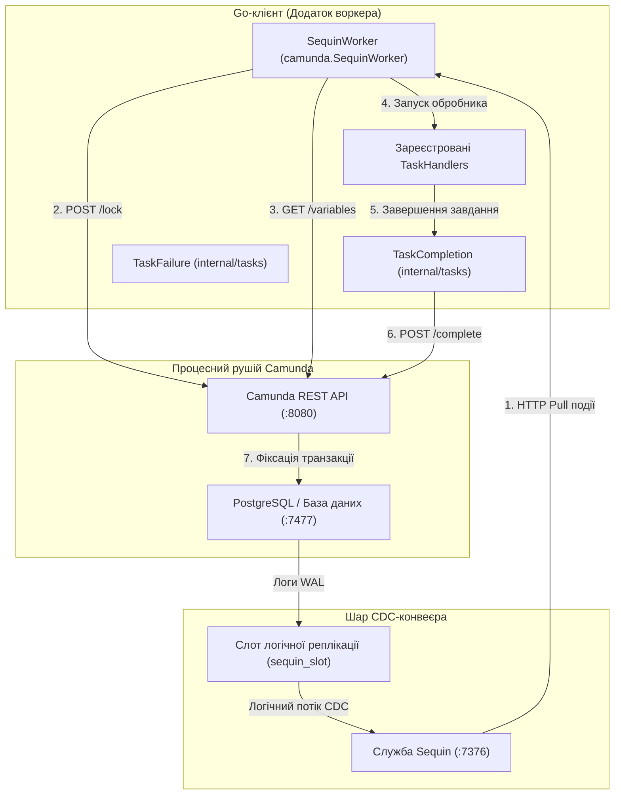

# Клієнт зовнішніх завдань Camunda

Високопродуктивний Go-клієнт для зовнішніх завдань Camunda 7, що підтримує як традиційне REST-опитування, так і обробку з надвисокою пропускною здатністю на основі **захоплення змін даних (WAL CDC)** з використанням Sequin.

---

## 1. Архітектурні патерни

Цей клієнт підтримує два різних патерни виконання залежно від вимог до навантаження вашої системи та складності розгортання:

### А. Стандартна архітектура REST-опитування (класична)
У стандартному патерні клієнт періодично надсилає REST-запити `/fetchAndLock` у рушій Camunda.
- **Плюси**: Простота, відсутність необхідності інтеграції бази даних або налаштування CDC. Працює з будь-якою базою даних Camunda 7.
- **Мінуси**: Високі накладні витрати на базу даних та мережеве опитування у стані спокою. Висока частота одночасних завершень завдань у паралельних мульти-інстансах може викликати виключення `OptimisticLockingExceptions` всередині API Camunda, призводячи до 60-секундних таймаутів блокувань при пікових навантаженнях.

### Б. Високопродуктивна архітектура WAL CDC (на базі Sequin) — без прямого підключення до БД
Замість опитування REST API архітектура CDC перехоплює події створення завдань безпосередньо з **журналу випереджаючого запису PostgreSQL (WAL)** за допомогою споживача потоку **Sequin** та обробляє завдання з оптимізованим блокуванням через REST. Воркер має **нульове пряме підключення** до бази даних Camunda.



#### Детальний робочий процес CDC:
1. **Захоплення подій**: При створенні нового зовнішнього завдання рядок вставляється в таблицю `act_ru_ext_task` Camunda. PostgreSQL записує цю транзакцію в журнал випереджаючого запису (WAL).
2. **Потокова передача через Sequin**: Sequin захоплює цю транзакцію через слот логічної реплікації (`sequin_slot`) та публікацію (`sequin_pub`) і надає її у вигляді черги HTTP Pull.
3. **Доставка через HTTP Pull**: `SequinWorker` отримує повідомлення із Sequin через `/receive`. **Таймаут видимості** (Visibility Timeout) Sequin гарантує, що це повідомлення буде доставлено лише одному воркеру, усуваючи необхідність у блокуваннях конкуренції на рівні бази даних.
4. **Активація блокування через REST**: Воркер блокує завдання через REST API Camunda (`POST /external-task/{id}/lock`), щоб задовольнити вимогам валідації завершення завдань рушієм.
5. **Запит змінних**: Після блокування воркер запитує змінні процесу через REST API Camunda (`GET /process-instance/{id}/variables`).
6. **Виконання**: Виконується зареєстрований обробник.
7. **Завершення завдання**: Обробник завершує виконання та використовує REST API (`/external-task/{id}/complete`) для фіксації завершення завдання в рушії Camunda.
8. **Підтвердження**: Воркер надсилає HTTP ACK-запит у Sequin для видалення обробленої події з черги. При виникненні тимчасової помилки (наприклад, `OptimisticLockingException`) воркер надсилає NACK у Sequin, викликаючи миттєву повторну спробу.

---

## 2. Налаштування та міграції бази даних

### Налаштування БД за допомогою Atlas Go
Щоб безпечно ввімкнути слоти логічної реплікації CDC та схеми публікацій без зміни стандартних конфігурацій Docker, ми використовуємо [Atlas Go](https://atlasgo.io/). Конфігурація знаходиться під версійним контролем в [atlas.hcl](docker/camunda/atlas.hcl).

Міграції автоматично застосовуються під час розгортання за допомогою контейнера запуску `arigaio/atlas:latest-alpine`, який очікує ініціалізації таблиць схем Camunda перед налаштуванням реплікації:
- **`20260531100000_init_sequin.sql`**: Створює користувача Sequin, слот реплікації та публікацію.
- **`20260531100001_enable_replica_identity.sql`**: Налаштовує `REPLICA IDENTITY FULL` для таблиці `act_ru_ext_task`, щоб гарантувати, що корисні навантаження CDC містять повні дані про оновлення рядків.

### Високопродуктивна конфігурація
1. **Фільтрація цілей**: Обмежуйте джерела Sequin таблицею `"public.act_ru_ext_task"`, щоб уникнути вузьких місць продуктивності, викликаних змінами в таблицях змінних або історії.
2. **HTTP Keep-Alives**: Як REST, так и CDC воркери спільно використовують налаштований пул `http.Transport` (`MaxIdleConns = 100`, `MaxIdleConnsPerHost = 100`, `IdleConnTimeout = 90s`), щоб уникнути вичерпання ефемерних портів macOS/Linux (`TIME_WAIT`).

---

## 3. Приклади використання

### А. Запуск стандартного воркера REST-опитування
```go
package main

import (
	"context"
	"log/slog"
	"time"
	"github.com/nativebpm/connectors/camunda"
)

func main() {
	logger := slog.Default()
	client, err := camunda.NewClient("http://localhost:8080", "classic-worker")
	if err != nil {
		logger.Error("Failed to init client", "error", err)
		return
	}

	worker := camunda.NewWorker(client, logger)
	worker.SetMaxTasks(20)
	worker.SetPollInterval(100 * time.Millisecond)

	worker.RegisterHandler("creditScoreChecker", func(ctx context.Context, client *camunda.Client, task camunda.ExternalTask, complete camunda.CompleteFunc, fail camunda.FailFunc) error {
		// Бізнес-логіка тут
		return complete().Variable("score", 750).Execute()
	}, 60000, []string{"score"})

	worker.Start(context.Background())
}
```

### Б. Запуск воркера WAL CDC (Sequin) — без прямого підключення до БД
```go
package main

import (
	"context"
	"log/slog"
	"github.com/nativebpm/connectors/camunda"
)

func main() {
	logger := slog.Default()
	
	// Ініціалізація API-клієнта для завершення, блокування та отримання змінних
	client, err := camunda.NewClient("http://localhost:8080", "sequin-worker")
	if err != nil {
		logger.Error("Failed to init client", "error", err)
		return
	}

	// Ініціалізація Sequin-воркера з кінцевою точкою Sequin та консьюмером
	sequinURL := "http://localhost:7376"
	consumer := "camunda_tasks"

	sequinWorker, err := camunda.NewSequinWorker(client, sequinURL, consumer, logger)
	if err != nil {
		logger.Error("Failed to create Sequin worker", "error", err)
		return
	}

	sequinWorker.RegisterHandler("creditScoreChecker", func(ctx context.Context, client *camunda.Client, task camunda.ExternalTask, complete camunda.CompleteFunc, fail camunda.FailFunc) error {
		// Бізнес-логика тут
		return complete().Variable("score", 750).Execute()
	})

	sequinWorker.Start(context.Background())
}
```

---

## 4. Метрики продуктивності

У ході еталонного тестування з розгортанням робочого процесу `loan-granting.bpmn` ми оцінили традиційне REST-опитування та WAL CDC (з використанням споживача Sequin Pull) в умовах високого навантаження масштабування:
- **REST-опитування**: Агресивне опитування при масштабуванні призводить до станів очікування блокувань та транзакційних відкатів, викликаючи 60-секундні таймаути блокувань при одночасному завершенні паралельних завдань.
- **Sequin WAL CDC (без прямого підключення до БД)**:
  - **500 інстансів** (2 047 завдань): Завершено за **20.51 с** при **24.37 RPS / 99.79 TPS**.
  - **1000 інстансів** (4 014 завдань): Завершено за **71.52 с** при **13.98 RPS / 56.13 TPS** (метрики затримки: p50=57с, p90=67.5с, p99=70.4с).
  - **2000 інстансів** (8 036 завдань): Завершено за **22.41 с** при **89.26 RPS / 358.66 TPS** (метрики затримки: p50=13.8с, p90=20.4с, p99=21.1с).
  - **3000 інстансів** (12 027 завдань): Завершено за **133.62 с** при **22.45 RPS / 90.01 TPS** (це пікова межа навантаження, при якій досягається насичення процесора PostgreSQL та ліміт пулу з'єднань TCP).

Повні звіти про тестування продуктивності див. у детальному [звіті](examples/loadtest/camunda-load-test-results.md).
