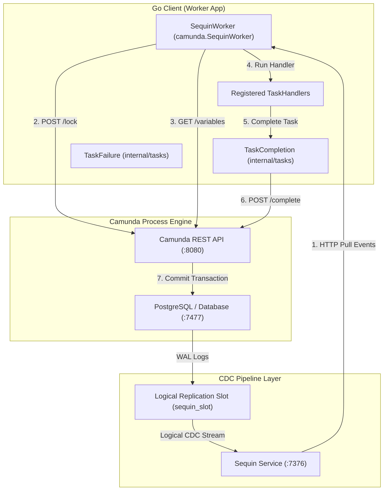

# Camunda External Task Client

A high-performance Go client for Camunda 7 external tasks, supporting both traditional REST polling and ultra-high-throughput **WAL-based Change Data Capture (CDC)** processing using Sequin.

---

## 1. Architectural Patterns

This client supports two distinct execution patterns depending on your system load requirements and deployment complexity:

### A. Standard REST Polling Architecture (Classic)
In the standard pattern, the client periodically sends `/fetchAndLock` REST requests to the Camunda Engine.
- **Pros**: Simple, zero database integration or CDC setups required. Works with any Camunda 7 database.
- **Cons**: High database & network polling overhead at rest. High concurrent completions on parallel multi-instances can trigger `OptimisticLockingExceptions` inside Camunda's API, causing 60-second lock timeouts under peak loads.

### B. High-Performance WAL CDC Architecture (Sequin-based) - Database-Free
Instead of polling the REST API, the CDC architecture captures task insertion events directly from the PostgreSQL **Write-Ahead Log (WAL)** using **Sequin** stream consumer, and processes tasks with optimized REST-based locking. The worker has **zero direct connection** to the Camunda database.



#### Detailed CDC Workflow:
1. **Event Capture**: When a new external task is created, a row is inserted into Camunda's `act_ru_ext_task` table. PostgreSQL writes this transaction to the Write-Ahead Log (WAL).
2. **Streaming via Sequin**: Sequin captures this transaction through a logical replication slot (`sequin_slot`) and publication (`sequin_pub`) and exposes it as an HTTP Pull queue.
3. **HTTP Pull Delivery**: The `SequinWorker` pulls messages from Sequin via `/receive`. Sequin's **Visibility Timeout** guarantees that this message is only delivered to one worker, eliminating the need for database-level concurrency locks.
4. **REST Lock Activation**: The worker locks the task via Camunda REST API (`POST /external-task/{id}/lock`) to satisfy the engine completion requirements.
5. **Variable Querying**: Once locked, the worker queries process variables via Camunda REST API (`GET /process-instance/{id}/variables`).
6. **Execution**: The registered handler is executed.
7. **Task Completion**: The handler finishes execution and uses the REST API (`/external-task/{id}/complete`) to commit the task completion back to the Camunda Engine.
8. **Acknowledgement**: The worker sends an HTTP ACK request to Sequin to remove the processed event from the queue. If a transient error occurs (e.g. `OptimisticLockingException`), the worker sends a NACK to Sequin, triggering an instant retry.

---

## 2. Tuning & Database Migrations

### Database Setup with Atlas Go
To enable CDC replication slots and publication schemas safely without editing default docker configs, we use [Atlas Go](https://atlasgo.io/). The configuration is version-controlled in [atlas.hcl](docker/camunda/atlas.hcl).

Migrations are automatically applied during deployment using the `arigaio/atlas:latest-alpine` runner container, which waits for Camunda schema tables to initialize before configuring replication:
- **`20260531100000_init_sequin.sql`**: Creates the Sequin user, replication slot, and publication.
- **`20260531100001_enable_replica_identity.sql`**: Configures `REPLICA IDENTITY FULL` on `act_ru_ext_task` to ensure the CDC payloads capture complete row updates.

### High-Performance Configuration
1. **Target Filtering**: Restrict Sequin sinks to `"public.act_ru_ext_task"` to avoid performance bottlenecks caused by variable or history table modifications.
2. **HTTP Keep-Alives**: Both REST and CDC workers share a tuned `http.Transport` pool (`MaxIdleConns = 100`, `MaxIdleConnsPerHost = 100`, `IdleConnTimeout = 90s`) to avoid macOS/Linux ephemeral port exhaustion (`TIME_WAIT`).

---

## 3. Usage Examples

### A. Running standard REST Polling Worker
```go
package main

import (
	"context"
	"log/slog"
	"time"
	"github.com/nativebpm/connectors/camunda"
)

func main() {
	logger := slog.Default()
	client, err := camunda.NewClient("http://localhost:8080", "classic-worker")
	if err != nil {
		logger.Error("Failed to init client", "error", err)
		return
	}

	worker := camunda.NewWorker(client, logger)
	worker.SetMaxTasks(20)
	worker.SetPollInterval(100 * time.Millisecond)

	worker.RegisterHandler("creditScoreChecker", func(ctx context.Context, client *camunda.Client, task camunda.ExternalTask, complete camunda.CompleteFunc, fail camunda.FailFunc) error {
		// Business logic here
		return complete().Variable("score", 750).Execute()
	}, 60000, []string{"score"})

	worker.Start(context.Background())
}
```

### B. Running WAL-based CDC Worker (Sequin) - Database-Free
```go
package main

import (
	"context"
	"log/slog"
	"github.com/nativebpm/connectors/camunda"
)

func main() {
	logger := slog.Default()
	
	// Initialize API client for completions, locks and variables fetching
	client, err := camunda.NewClient("http://localhost:8080", "sequin-worker")
	if err != nil {
		logger.Error("Failed to init client", "error", err)
		return
	}

	// Initialize Sequin worker with Sequin endpoint and consumer
	sequinURL := "http://localhost:7376"
	consumer := "camunda_tasks"

	sequinWorker, err := camunda.NewSequinWorker(client, sequinURL, consumer, logger)
	if err != nil {
		logger.Error("Failed to create Sequin worker", "error", err)
		return
	}

	sequinWorker.RegisterHandler("creditScoreChecker", func(ctx context.Context, client *camunda.Client, task camunda.ExternalTask, complete camunda.CompleteFunc, fail camunda.FailFunc) error {
		// Business logic here
		return complete().Variable("score", 750).Execute()
	})

	sequinWorker.Start(context.Background())
}
```

---

## 4. Performance Metrics

Under benchmark testing deploying the `loan-granting.bpmn` workflow, we evaluated traditional REST polling and WAL CDC (using Sequin Pull consumer) under heavy scaling pressures:
- **REST Polling**: Aggressive polling at scale experiences lock wait states and transactional rollbacks, leading to 60-second lock timeouts under concurrent completion of parallel tasks.
- **Sequin WAL CDC (Database-Free)**:
  - **500 instances** (2,047 tasks): Completed in **20.51s** at **24.37 RPS / 99.79 TPS**.
  - **1000 instances** (4,014 tasks): Completed in **71.52s** at **13.98 RPS / 56.13 TPS** (Latency metrics: p50=57s, p90=67.5s, p99=70.4s).
  - **2000 instances** (8,036 tasks): Completed in **22.41s** at **89.26 RPS / 358.66 TPS** (Latency metrics: p50=13.8s, p90=20.4s, p99=21.1s).
  - **3000 instances** (12,027 tasks): Completed in **133.62s** at **22.45 RPS / 90.01 TPS** (This is the peak load limit where PostgreSQL CPU saturation and TCP connection pooling limits are reached).

For full benchmark reports, refer to the detailed [report](examples/loadtest/camunda-load-test-results.md).
