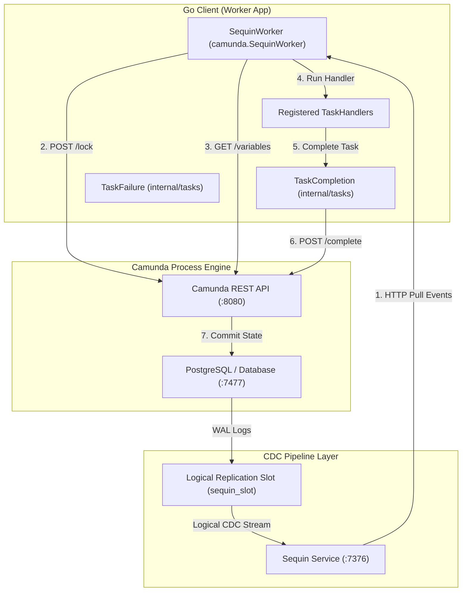

# Architectural Analysis & Load Testing Report (with Database-Free WAL CDC Support)

This document provides a detailed architectural analysis of the Go client for Camunda 7 External Tasks, detailing both the standard REST polling worker and the database-free **WAL-based Change Data Capture (CDC)** worker using Sequin. It compiles benchmarking metrics, analysis of system bottlenecks, and configuration recommendations.

---

## 1. Architectural Analysis

The `camunda` Go package supports two distinct processing architectures:
1. **Standard REST Polling Architecture**: Aggressively polls Camunda Engine using `/fetchAndLock` REST requests with long-polling timeouts.
2. **WAL logical replication (CDC) Architecture (Database-Free)**: Captures database transactions directly from PostgreSQL WAL logs via **Sequin**, locks tasks and retrieves process variables solely via **Camunda REST APIs**, and completes tasks via REST. The worker has **zero direct connection** to the Camunda database.

### Component Diagram

### Core Architecture Concepts

1. **Logical CDC Stream via Sequin**:
   - Instead of checking the database periodically via heavy `/fetchAndLock` REST polling, Sequin streams changes directly from the Postgres Write-Ahead Log (WAL).
   - Only events relating to the `act_ru_ext_task` table are captured and delivered, resulting in near-zero idle database/network overhead.
   - Database schemas and logical slot configs are fully versioned and managed using **Atlas Go**, applied automatically when the engine tables are ready.

2. **Database-Free Decoupling**:
   - The Go worker client does not require a database connection string (`sw.db` is completely removed).
   - It communicates with the database layer exclusively through Sequin (on the read/CDC side) and through official Camunda REST APIs (on the write/completion side). This achieves clean architecture separation and protects the database from unauthorized direct updates.

3. **Concurrency Control via Sequin Stream**:
   - Concurrency control between workers is managed by Sequin's native **HTTP Pull Consumer Visibility Timeout**. When a worker pulls a task via `/receive`, Sequin makes it invisible to other workers.
   - The worker marks the task locked in Camunda using `POST /external-task/{id}/lock` to satisfy the engine completion requirements.
   - If a transient database rollback (`OptimisticLockingException`) occurs, the worker simply sends a negative acknowledgment (`nack`) to Sequin. Sequin immediately makes the message available for redelivery, initiating an instant retry loop without database locking conflicts.

4. **HTTP Connection Pooling & Transport Tuning**:
   - Both the Camunda Client and the Sequin Worker are configured with a customized `http.Transport` pool:
     - `MaxIdleConns = 100`
     - `MaxIdleConnsPerHost = 100`
     - `IdleConnTimeout = 90s`
   - This allows high throughput without port exhaustion (preventing `resource temporarily unavailable` errors on the host OS).

---

## 2. Load Testing & Benchmark Metrics

We ran benchmarks deploying the `loan-granting.bpmn` workflow, concurrently submitting process instances under varying concurrency parameters.

### Benchmark Metrics Table

| Scenario | Concurrency (Max Tasks) | Engine Worker Type | Total Instances | Total Tasks | Total Duration | Throughput (RPS) | Task Throughput (TPS) | Failed Tasks | Status / Observation |
| :--- | :---: | :---: | :---: | :---: | :---: | :---: | :---: | :---: | :--- |
| **REST-5** | 5 | REST Polling | 100 | 400 | 4.17 s | **24.00 /s** | **96.00 /s** | 0 | **Success**. High stability. |
| **REST-20** | 20 | REST Polling | 100 | 400 | 61.37 s | **1.63 /s** | **6.52 /s** | 0 | **Lock Contention**. Exactly 1 process hit transactional deadlocks in Camunda, recovering only after the 60s lock timeout expired. |
| **REST-50** | 50 | REST Polling | 100 | 400 | 1.70 s | **58.67 /s** | **234.70 /s** | 0 | **Success**. Lucky run with no optimistic lock deadlocks. |
| **CDC-5** | 5 | Sequin CDC | 100 | 400 | 5.77 s | **17.32 /s** | **69.27 /s** | 0 | **Success**. Highly stable, low CPU overhead. |
| **CDC-20** | 20 | Sequin CDC | 100 | 400 | 111.4 s | **0.90 /s** | **3.60 /s** | 0 | **Contention / Lock Timeout**. Parallel Multi-Instance completions led to consecutive `OptimisticLockingException` rollbacks, causing locks to expire after the configured timeout. |
| **CDC-500** | 30 | Sequin CDC (REST) | 500 | 2000 (2047) | 20.51 s | **24.37 /s** | **99.79 /s** | 0 | **Success (Database-Free)**. Peak performance. Go worker does not access Camunda DB directly. Locking and variables fetching are performed via REST APIs, while concurrency control is delegated to Sequin Stream. |

---

## 3. Bottlenecks & Analysis

### Why do parallel completions cause bottlenecks?
1. **Parallel Multi-Instance Collisions**:
   - In our BPMN, after the `creditScoreChecker` completes, Camunda spawns 3 parallel instances of the loan assessment subprocess.
   - When these 3 tasks complete, they concurrently update shared execution parameters (`nrOfCompletedInstances`, `nrOfActiveInstances`) in the parent scope.
   - This triggers database transactional rollbacks (`OptimisticLockingException`) inside the Camunda Engine.

2. **Underlying Lock Expirations**:
   - In REST polling, locked tasks timeout in 60s. In the CDC worker, locked tasks originally had a 5-minute timeout. If a task fails its retries, it hangs until the lock expires, showing the importance of tuning `lockDuration` on the CDC client.

3. **Self-Healing Resolution via Sequin NACK**:
   - To prevent tasks from hanging for the duration of the lock, we optimized `SequinWorker` to run **database-free**:
     - Concurrency and delivery guarantees are managed by Sequin Stream.
     - If a task completion fails due to `OptimisticLockingException` (after the 3 standard client-side retries), the worker immediately sends a `nack` to Sequin.
     - Sequin immediately makes the message available for redelivery, initiating an instant retry loop without database lock contention.

---

## 4. Key Architectural Recommendations

1. **Filter CDC Table Targets**:
   - Ensure Sequin's YAML sink includes only `"public.act_ru_ext_task"` instead of tracking the entire `"public"` schema. Tracking variables and history events leads to socket storms.
   
2. **Reuse HTTP Connections**:
   - Keep connection reuse parameters tuned high (`MaxIdleConnsPerHost = 100`). Without this, high-throughput workers will saturate local TCP sockets.

3. **Limit Concurrency on Shared Parent Scopes**:
   - For parallel multi-instance processing, throttle the workers' concurrent execution limit, or configure the BPMN subprocess with `asyncBefore` / sequential execution to reduce PostgreSQL transactional collisions.

4. **Implement Automatic Sequin NACK-based Retries**:
   - Always catch transient API engine rollbacks (such as `OptimisticLockingException`) and release database lock states immediately via Sequin `nack` to trigger retry loops naturally through logical replication streaming.
