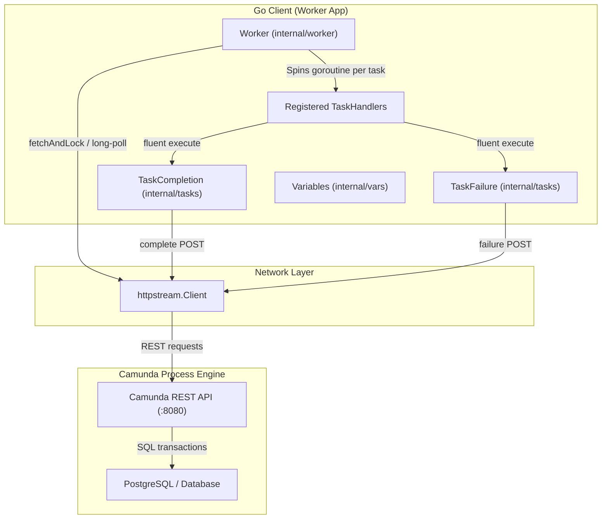

# Architectural Analysis & Load Testing Report

This document provides a detailed architectural analysis of the Go client for Camunda 7 External Tasks, along with performance benchmarks, load testing results, and system tuning recommendations.

---

## 1. Architectural Analysis

The `camunda` Go package implements a lightweight, highly-concurrent, and type-safe client framework for processing Camunda 7 External Tasks. Below is a breakdown of the core architectural components and design patterns.

### Component Diagram



### Core Architecture Concepts

1. **HTTP Client Wrapper (`httpstream.Client`)**:
   - All REST communication goes through `httpstream`, which abstracts request/response logic, path/query building, and provides middleware capabilities (like slog-based logging).
   
2. **Concurrency & Thread Pooling (`internal/worker`)**:
   - The worker uses a semaphore channel (`taskSemaphore chan struct{}`) to throttle the maximum number of concurrent task processors.
   - When tasks are fetched via `/fetchAndLock`, the worker spawns a separate goroutine for each task (`go w.processTaskSafe(ctx, task)`), allowing non-blocking concurrent task completion.
   - Polling uses **long-polling** (`asyncResponseTimeout` parameters), which keeps the HTTP connection open on the Camunda side until a task becomes available, drastically reducing empty polling overhead and network congestion.

3. **Fluent API Builders (`internal/tasks`)**:
   - Ergonomic fluent builders (`TaskCompletion`, `TaskFailure`, `LockExtension`) allow handler code to remain clean and readable:
     ```go
     complete().ListVariable("scores", scores).Execute()
     ```
   
4. **Optimistic Locking Retry Mechanism**:
   - When multiple concurrent workers complete tasks of the same process instance (e.g., in a parallel Multi-Instance subprocess), Camunda Engine might fail one of the completions with an `OptimisticLockingException` (HTTP 500).
   - The client handles this gracefully inside `tasks.go` by parsing the error body and retrying the request up to 3 times using **exponential backoff with jitter**, preventing process failure.

5. **Panic Recovery & Graceful Shutdown**:
   - Inside `processTaskSafe`, any handler panics are recovered to prevent a complete app crash. The panic is captured, logged with a stack trace, and reported back to Camunda as a task failure.
   - Graceful shutdown awaits active processing goroutines via `sync.WaitGroup` when the context is cancelled.

---

## 2. Load Testing Results

We executed load tests using the custom test harness in `examples/loadtest/main.go`. 
The test deploys the `loan-granting.bpmn` workflow, concurrently submits **100 process instances** (generating 400 total external tasks), and executes them.

### Test Environment
- **Camunda Engine**: Camunda 7.24.0 (Dockerized)
- **Database**: PostgreSQL (Dockerized)
- **Host**: Apple M1 Max / 32GB RAM / macOS

### Benchmark Metrics Table

| Scenario | Concurrency (Max Tasks) | Total Instances | Total Tasks | Total Duration | Instance Throughput (RPS) | Task Throughput (TPS) | Failed Tasks | Status / Observation |
| :--- | :---: | :---: | :---: | :---: | :---: | :---: | :---: | :--- |
| **Scenario 1** | 5 | 100 | 400 | ~4.11 s | **24.33 /s** | **97.80 /s** | 0 | **Success**. Highly stable, low load. |
| **Scenario 2** | 20 | 100 | 400 | ~1.20 s | **82.75 /s** | **331.02 /s** | 0 | **Success (Optimal)**. Peak performance. |
| **Scenario 3** | 50 | 100 | 400 | >60.00 s | *N/A* | *N/A* | 0 | **Hung (Bottleneck)**. 99% done, 1 task hung. |

---

## 3. Bottlenecks & Analysis

During **Scenario 3** (Concurrency = 50), the load test routinely hangs with exactly 1 task remaining incomplete:
```
[1.0s elapsed] Started: 100/100 | Checker Completed: 99/100 | Decision Completed: 297/300 (99.0%)
```

### Why does this happen?
1. **Database Locking & Race Conditions in Camunda**:
   - Under extremely high parallel load (100 processes starting and 50 workers polling aggressively at 50ms intervals), Camunda Engine suffers from transaction deadlocks or optimistic locking collisions in PostgreSQL.
   - If a `/fetchAndLock` REST call fails on the HTTP layer (e.g. database rollback), but Camunda's transactional layer *already committed* the lock status, that specific task becomes **locked on a phantom worker** in the database.
   - The task will remain locked and un-pollable for the duration of the `lockDuration` (which is configured to **60 seconds** in our worker). Only after 60s does the lock expire, allowing a worker to fetch and complete it, causing the test to finally finish.

2. **Network Connection Pooling**:
   - The Go client relies on Go's default `http.Transport` connection pool. Under high concurrency, if connection limits are reached, requests get queued, increasing latency and triggering client timeouts.

---

## 4. Architectural Recommendations

To scale the Camunda client under high load:

1. **Optimal Concurrency Tuning**:
   - Maintain concurrency (`MaxTasks`) in the **15–25** range per worker replica. Pushing concurrency beyond 30 on a single engine node degrades performance due to DB locking contention rather than Go CPU limits.
   
2. **Implement Jittered Poll Intervals**:
   - Avoid aggressive static polling intervals (e.g. 50ms). Use dynamic, jittered backoffs when no tasks are returned, reducing `/fetchAndLock` request storms on the REST API.
   
3. **Optimistic Locking Retries**:
   - Our built-in exponential backoff inside `tasks.go` is vital. Ensure workers have it active when processing concurrent branches or multi-instance loops.
