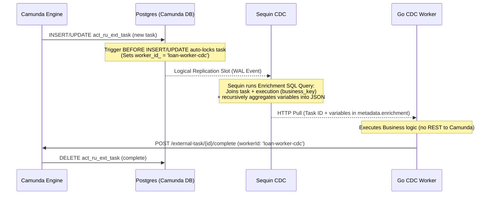

# Camunda 7 CDC Outbox Example (Zero-REST-Lookup Model)

Этот пример демонстрирует обработку внешних задач (External Tasks) Camunda 7 с использованием паттерна **Database Transactional Outbox** через **Sequin Change Data Capture (CDC)**.

Отличие от стандартных подходов заключается в том, что воркер **вообще не выполняет REST-запросы к Camunda для опроса (`fetchAndLock`), блокировки (`Lock`) или получения переменных процесса (`GetVariables`)**. Вся необходимая информация доставляется воркеру напрямую внутри CDC-сообщения от Sequin.

---

## Архитектура решения

Схема движения данных и управления жизненным циклом задачи выглядит следующим образом:



### Ключевые компоненты:

1. **Авто-блокировка задач (БД-триггер):**
   Camunda REST API требует, чтобы задача была заблокирована (`workerId` и `lockExpiration`) перед тем, как её можно будет завершить с помощью `/complete`. Мы решили эту задачу через базу данных. Триггер `BEFORE INSERT OR UPDATE` на таблице `act_ru_ext_task` автоматически прописывает `worker_id_ = 'loan-worker-cdc'` и устанавливает пятиминутную блокировку, если `worker_id_` пуст.

2. **Обогащение данных через Sequin (SQL Enrichment):**
   Вместо дополнительной outbox-таблицы, Sequin CDC слушает изменения стандартной таблицы задач `act_ru_ext_task` и на лету обогащает событие с помощью SQL-запроса:
   - Объединяет задачу с таблицей `act_ru_execution` для получения `business_key`.
   - Рекурсивно поднимается по дереву выполнения (parent executions) до корня, собирает все переменные из `act_ru_variable` и преобразует их в единый JSON-объект, корректно обрабатывая затенение (shadowing) глобальных переменных локальными.
   - Записывает результат в поле `metadata.enrichment` сообщения.

3. **Легковесный Go воркер (`OutboxWorker`):**
   Воркер опрашивает HTTP long-polling API Sequin, извлекает задачу и переменные из поля `enrichment` сообщения, запускает бизнес-логику и отправляет единственный REST-запрос на завершение задачи: `/external-task/{id}/complete` с `workerId = 'loan-worker-cdc'`.

---

## Запуск примера

### 1. Подготовка окружения
Пересоздайте контейнеры Camunda, Postgres и Sequin, чтобы применились новые миграции БД и конфигурация `playground.yml`:

```bash
cd camunda
make camunda
```

После запуска контейнеров применится миграция `20260603000000_add_task_autolock_trigger.sql`, которая создаст триггер авто-блокировки, а Sequin перечитает обновленный `playground.yml` и применит enrichment-функцию к сингу.

### 2. Запуск Go приложения
Перейдите в директорию примера и запустите его:

```bash
cd examples/loan-granting-cdc-outbox
go run main.go
```

Приложение выполнит следующие шаги:
1. Задеплоит BPMN-процесс `loan-granting.bpmn` в Camunda.
2. Сгенерирует и запустит 5 тестовых кредитных заявок.
3. Кастомный CDC-воркер начнет обрабатывать задачи, которые Sequin поставляет из таблицы `act_ru_ext_task`.
4. Воркер успешно выполнит бизнес-логику и завершит задачи в Camunda, делая ровно один запрос `Complete` на задачу.

### 3. Верификация результатов
В консоли вы увидите подробные логи выполнения. Обратите внимание, что логи логирования Camunda REST API (через `httpstream.LoggingMiddleware`) не будут содержать запросов к `/lock` или `/variables`. Будут выполняться только запросы на деплоймент, старт процессов и `/complete`.
